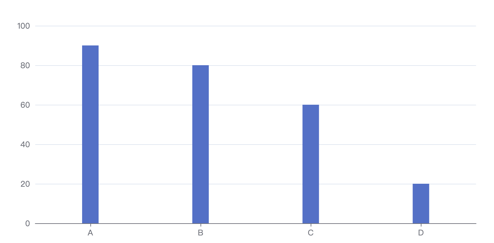
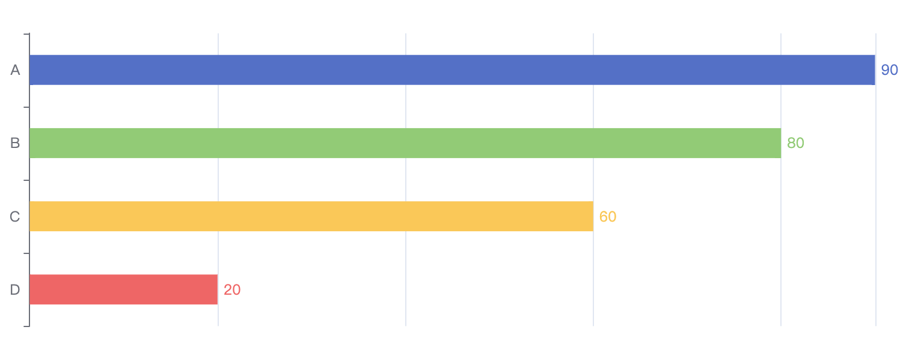
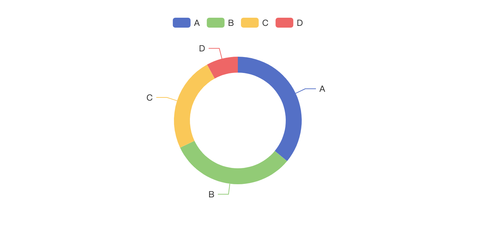
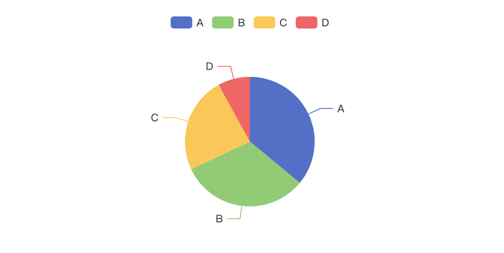
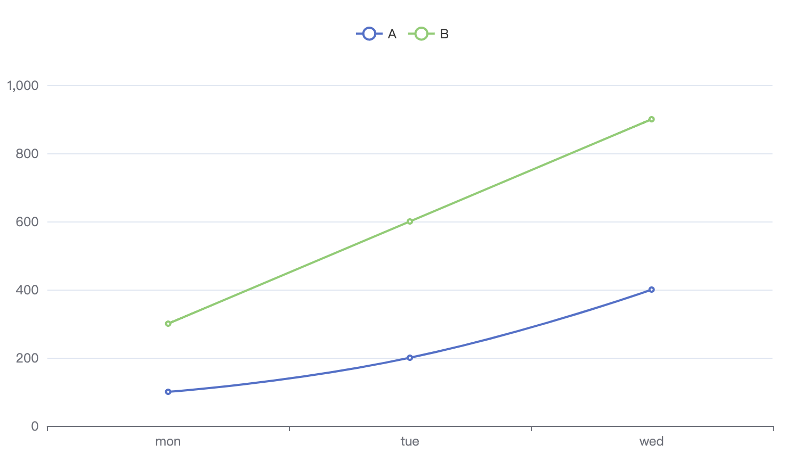

# vue-charts-cmp
## vue3 (不支持vue2)


### 引入文件
```
import XXX from 'vue-charts-cmp';
import "vue-charts-cmp/dist/vcc-chart.css";
```

### options 参考echarts官网配置

### 基础柱状图

```
<vcc-verticalbar
      :source="testData"
      :color="color"
      :options="options"
      :title="title"
      :subTitle="subTitle"
    />

数据源格式:  array
testData=[{name: 'A', value: 20}, {name: 'B', value: 10}]

基色：String
color= '#5470c6';

图表配置项：object
options

图表主标题：string
title

图表副标题：string
subtitle    
```

### 横向柱状图

```
<vcc-reversebar
      :source="testData"
      :colors="colors"
      :options="options"
      :title="title"
      :subTitle="subTitle"
    />

数据源格式:  array
testData=[{name: 'A', value: 20}, {name: 'B', value: 10}]

基色：array
colors=['#5470c6', '#91cc75', '#fac858', '#ee6666', '#73c0de', '#3ba272', '#fc8452', '#9a60b4','#ea7ccc'] 

图表配置项：object
options

图表主标题：string
title

图表副标题：string
subtitle
```


### 饼状图



```
<vcc-piebar
      :source="testData"
      :options="options"
      :title="title"
      :subTitle="subTitle"
      :ring="ring"
      :chartHeight="height"
      :labelled="labelled"
      :colors="colors"
    />

数据源格式: array
testData=[{name: 'A', value: 20}, {name: 'B', value: 10}]

图表配置项：object
options

图表主标题：string
title

图表副标题：string
subtitle

图表类型：bool
ring： true -> 空心环； false -> 实心饼

图表高度：number
chartHeight

图表是否展示每部分数据： bool
labelled

基色：array
colors=['#5470c6', '#91cc75', '#fac858', '#ee6666', '#73c0de', '#3ba272', '#fc8452', '#9a60b4','#ea7ccc'] 
```

### 基础折线图

```
<vcc-blinebar
      :source="testData"
      :options="options"
      :title="title"
      :subTitle="subTitle"
      :colors="colors"
    />

数据源格式: array
testData=[
  {name: 'A', data: [{name: 'won', 'value': 10}, {name: 'tue', 'value': 10}]}, 
  {name: 'B', data: [{name: 'won', 'value': 10}, {name: 'tue', 'value': 10}]}
]

图表配置项：object
options

图表主标题：string
title

图表副标题：string
subtitle

基色：array
colors=['#5470c6', '#91cc75', '#fac858', '#ee6666', '#73c0de', '#3ba272', '#fc8452', '#9a60b4','#ea7ccc'] 
```